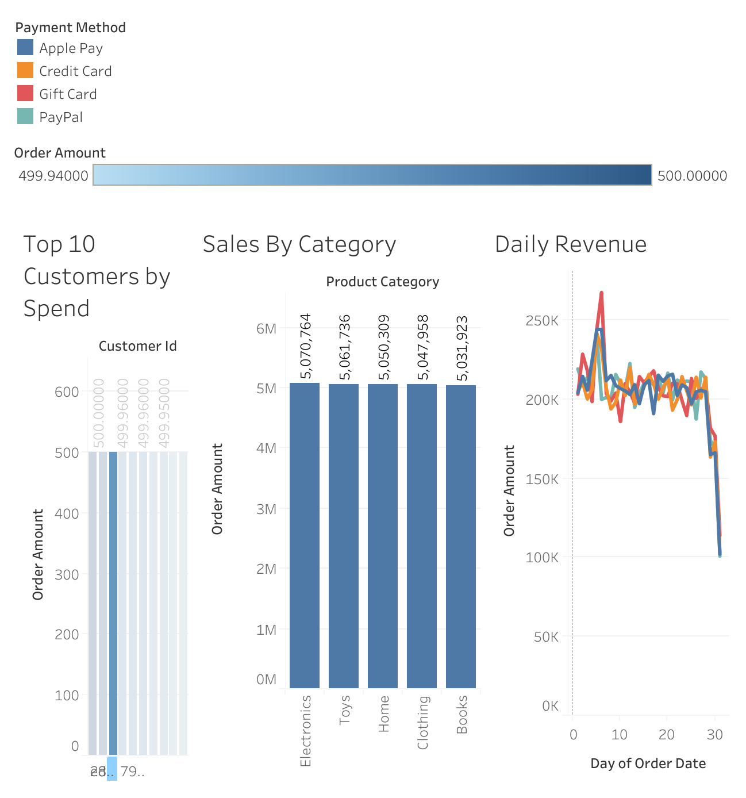

# 🛒 E-Commerce ETL Pipeline Project

This project demonstrates an end-to-end data pipeline simulating e-commerce sales data. It highlights skills in Python-based data generation, SQL-based transformations in Snowflake, and data visualization using Tableau Public.

---

## 📌 Project Overview

**Goal:** Build a scalable ETL pipeline to simulate, process, and analyze sales data for a fictional e-commerce business.

**Stack Used:**
- 🐍 Python (Faker, Pandas, Colab)
- ❄️ Snowflake (Data Warehouse)
- 📊 Tableau Public (Dashboards)

- 📝 GitHub (Documentation & Version Control)

---

## 🧱 Pipeline Architecture

```text
+----------------+      +-------------+      +-------------+      +------------------+
| Python (Faker) | -->  | orders.csv  | -->  | Snowflake   | -->  | Tableau Dashboards |
+----------------+      +-------------+      +-------------+      +------------------+
    [Extract]              [Raw File]         [Transform]              [Visualize]
